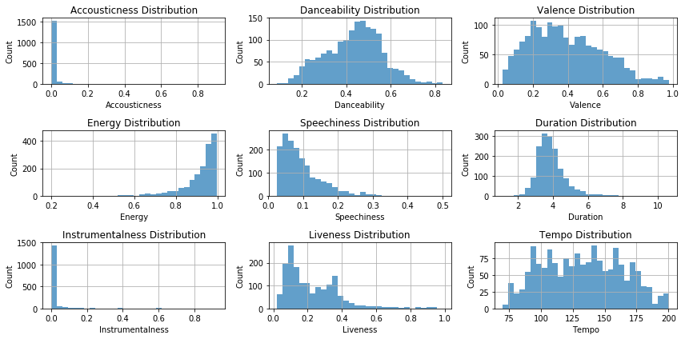
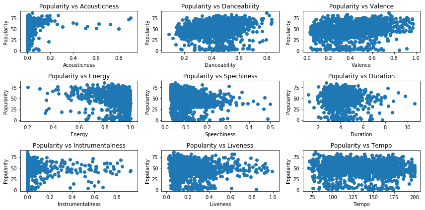
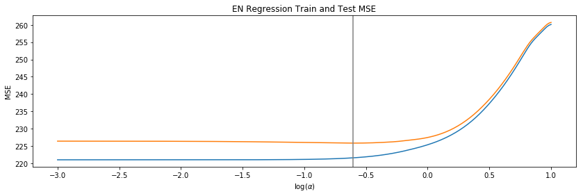

# Investigating Audio Features using Spotify Data

## Project Description:

For this project, I will be exploring music from three of my personal playlists on Spotify for my three favorite genres of music. Each song has audio features engineered by Spotify associated with it that will be explored in relation to the particular songs popularity metric. For this study I will be attempting to answer two main questions:

- Can I predict the popularity for a song based on the audio features of the song?
- Can I predict whether someone likes a song based on audio features?

## Data Source:

By using the Spotify API and the python library called Spotipy, audio features for each song were pulled into a dataframe. Similarly, these tracks all have a metric called popularity which were extracted and placed into the same dataframe as the audio features and used as the target for linear regression. The dataset for logistic regresion was acquired from Kaggle where the user used the same API process to generate the audio features data. This dataset contains 1000 songs that the user liked and 1000 that the user did not like, which was used as the target for logistic regression.

Some of the main audio features included are:
- Danceability (how suitable a song is for dancing)
- Loudness (average db level across song)
- Valence (musical positiveness conveyed by a track)
- Accousticness (whether a track contains vocals)
- Energy (perceptual measure of intensity)
- Tempo (estimated BPM of a song)
- Popularity (measure from 0 to 100)

A list of all the features can be found at this [link](https://developer.spotify.com/documentation/web-api/reference/tracks/get-audio-features/).

## EDA:

I first analyzed the popularity distribution for each genre:

Given the high distribution of 0 popularity, I replaced these values with the K nearest neighbor technique and with the mean of the genre and compared the result.

Then examining the distribution of features:

Ultimately the EDA was devoid of any discernible insights. The plots did not show a clear relationship or correlation between popularity and any of the features.

## Feature Engineering:

There was not much feature engineering needed in this study. All the audio features and popularity metric were engineered by Spotify. The only feature engineering done was modifying the song duration feature from ms to minutes.

## Part 1: Linear Regression
For linear regression, 10 fold cross-validation was utilized along with finding the alpha value that minimized the test MSE. Ridge, Lasso, and ElasticNet models were used and the results are shown below.

Ridge:

Lasso:

ElasticNet:

Model Comparison
- Ridge: RMSE = 13.94
- Lasso: RMSE = 13.93
- Linear: RMSE = 13.96
- Elastic net: RMSE = 13.89

The elastic net model performed the best of the four models with a slightly lower RMSE. Attempts were made to improve this model by removing some features but did not result in a lower RMSE. To attempt to see which predictors were best in this model, a bootstrapping method was used. Using 1000 bootstrap samples with an elastic net model, the distribution of coefficients for each predictor can be visualized with the plot below.

## Part 2: Logistic Model
First, I visualized the distributions of the audio features for when the user either disliked or liked a song.

From visualization, it appears that the energy, loudness, and valence features influence whether this user likes a song the most.

The distribution of positive and negative responses in this dataset appears to be unbiased.

Running a logistic model on the training set results in the following confusion matrix when applied to the test set.

- Recall: .61
- Precision: .67
- F1 Score: .64

## Future Development:

- Use supervised models to make predictions
- Test model on new playlist
- Acquire more data
- Explore more features such as
  - Number of plays
  - Song release date
  - Lyrical content

## References:

- https://www.kaggle.com/geomack/spotifyclassification/home
- https://developer.spotify.com/
- https://github.com/plamere/spotipy
