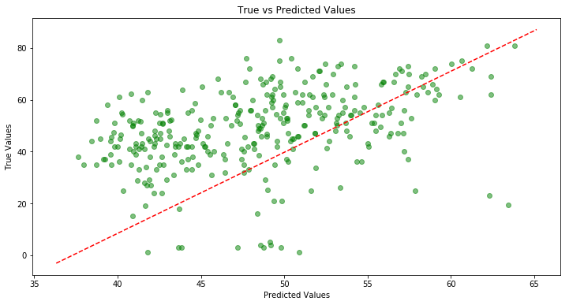
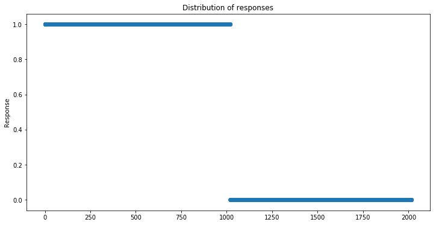

# Investigating Audio Features using Spotify Data

## Project Description:

For this project, I explored the popularity of songs from three of my personal playlists (313 artists ~1700 songs) on Spotify for my three favorite genres of music. In addition, I explored a dataset containing 2000 songs that a user classified as either a song they liked or disliked. Each song has audio features engineered by Spotify that attempt to quantify different characteristics of a song. In addition, Spotify engineers a popularity metric for each song to quantify how popular a song is. For this study I attempted to answer two main questions:

- Can I predict the popularity for a song based on the audio features of the song?
- Can I predict whether someone likes a song based on audio features of that song?

## Data Source:

By using the Spotify API and the python library called `Spotipy`, audio features for each song were pulled into a dataframe. Similarly, the popularity metric was extracted and placed into the same dataframe and used as the target for linear regression. The dataset for logistic regression was acquired from Kaggle where the user used the same process with the API to generate the audio features data. This dataset contains a target variable either 0 for a song they do not like or 1 for one they do like.

## EDA:

Some of the main audio features included are:
- Danceability (how suitable a song is for dancing)
- Loudness (average db level across song)
- Valence (musical positiveness conveyed by a track)
- Accousticness (whether a track contains vocals)
- Energy (perceptual measure of intensity)
- Tempo (estimated BPM of a song)
- Popularity (measure from 0 to 100)

A list of all the features can be found at this [link](https://developer.spotify.com/documentation/web-api/reference/tracks/get-audio-features/).

I first analyzed the popularity distribution for each genre:

Given the high distribution of 0 popularity, I replaced these values using the K nearest neighbor technique and using the mean of the genre and compared the result.

Before diving in, I wanted to see if the difference in mean popularity for each genre was statistically significant.

The p-values are extremely low, meaning that the difference in means is statistically significant.

Then examining the distribution of features:

Ultimately the EDA was devoid of any discernible insights. The plots did not show a clear relationship or correlation between popularity and any of the features. The distribution plots for the features however did show either a right or left skew for many of the features.

## Feature Engineering:

For this study, I performed the following for feature engineering:
- Converted the duration data from ms to minutes.
- Used dummy variables for the three different genres.
- Log transform of features most right skewed.

## Part 1: Linear Regression
Using regular linear regression, the studentized residuals
were examined against the predicted popularity.

This plot shows that the residuals are higher than they should be. The model is predicting too high for popularity of the song. Regularized regression will most likely be more beneficial in this case.

For regularized regression, 10 fold cross-validation was utilized along with finding the optimal alpha value that minimized the test MSE. Ridge, Lasso, and Elastic net models were used and the results are shown below.

Ridge:

Lasso:

Elastic net:

Model Comparison
- Ridge: RMSE = 13.94, R^2 = .202
- Lasso: RMSE = 13.93, R^2 = .205
- Linear: RMSE = 13.96, R^2 = .166
- Elastic net: RMSE = 13.89, R^2 = .208

The elastic net model performed the best of the four models with a slightly lower RMSE. Attempts were made to improve this model by removing some features and transforming some features, but did not result in a lower RMSE. To attempt to see which predictors were best in this model, a bootstrapping method was used. Using 1000 bootstrap samples with an elastic net model, the distribution of coefficients for each predictor was examined.

From these plots, it appears that the best predictors are danceability, valence, loudness, time_signature, and the alternative and metalcore genres.

## Part 2: Logistic Model
First, I visualized the distributions of the audio features for when the user either disliked or liked a song.

From visualization, it appears that the energy, loudness, and valence features influence whether a user likes a song the most.

The distribution of positive and negative responses in this dataset appears to be unbiased.

Running a logistic model on the training set resulted in the following confusion matrix when applied to the test set.

- Recall: .61
- Precision: .67
- F1 Score: .64

This curve shows an area under the curve of .65 which means that this model was a fairly poor fit for classification of  whether the user likes a song or not.

## Future Development:

- Transformations on features to reduce skew
- Use supervised models to make predictions.
- Test model on new playlist.
- Acquire more data from different genres.
- Explore more features such as:
  - Number of plays
  - Song release date
  - Lyrical content

## References:

- https://www.kaggle.com/geomack/spotifyclassification/home
- https://developer.spotify.com/
- https://github.com/plamere/spotipy
